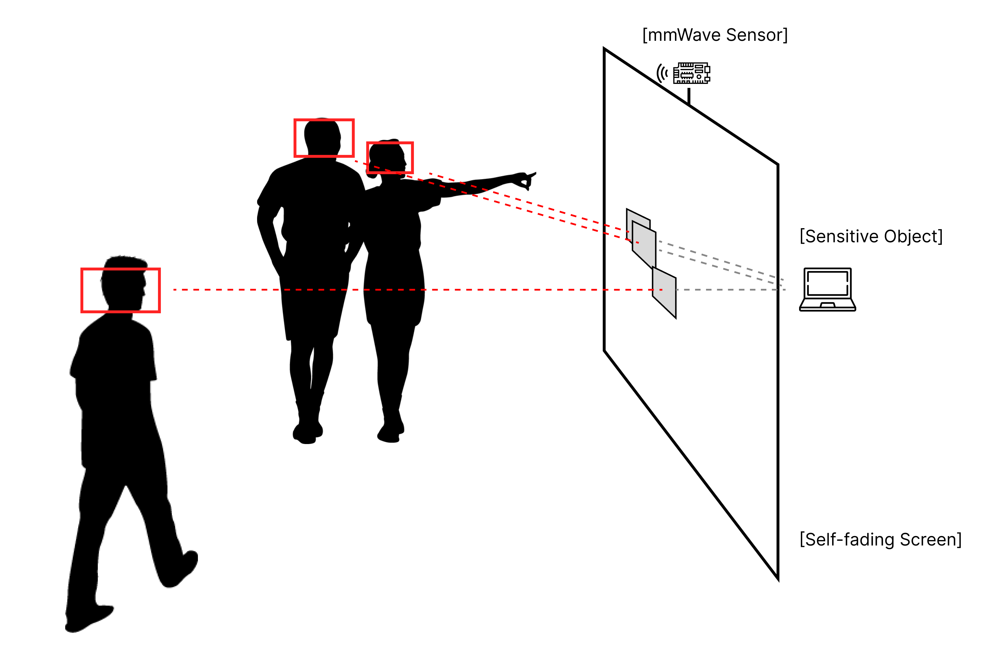
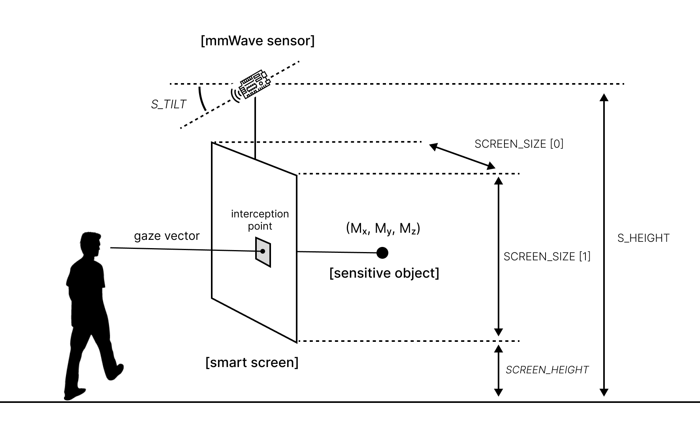

# Real-time mmWave Multi-Person Pose Estimation System for Privacy-Aware Windows

This repository implements a top-down approach to **Multi-Person Pose Estimation (MPPE)** through Multi Target Tracking (MTT) for monitoring the presence of humans entering a scene and **Pose Estimation** on every bounding box to estimate the location of 19 human-joint keypoints. It includes functionalities to estimate targets' line-of-sight and ensures privacy protection by activating local opacities on self-fading smart windows. The system is specifically designed to receive radar data from the **IWR1443** millimeter-wave sensor by Texas Instruments. 

<p align="center">
  
</p>


NOTE: This repository uses a simplified [GTRACK](https://dev.ti.com/tirex/explore/node?node=A__AYZwK7t1GX7lsaN.HegOQw__RADAR-ACADEMY__GwxShWe__LATEST) algorithm for tracking and modifies the [MARS model](https://github.com/SizheAn/MARS) architecture for posture estimation module.

## About

This is the repository for my MSc thesis: 
[*Real-time mmWave Multi-Person Pose Estimation System for Privacy-Aware Windows*]() (not linked yet)

<p align="center">
  
</p>

## Getting Started

### Installation and Execution


1. Clone this repository.
   ```sh
   git clone https://github.com/AsteriosPar/mmWave_MSc
   ```

2. Install Dependencies.
   ```sh
   pip install -r requirements.txt
   ```
3. Adjust the system and scene configurations from the default directory `./src/constants.py`.

4. (Optional) For creating\logging an experiment for offline experimentation, in the directory of the local copy run the logging module.
    ```sh
    python3 ./src/DataLogging.py
    ```

5. Run the program online or offline on a logged experiment.
    ```sh
    # online
    python3 ./src/main.py

    # offline
    python3 ./src/offline_main.py
    ```


## Setting up the scene 
All the necessary scene configuration parameters are shown in the picture below. **NOTE:** Make sure to set the *SCREEN_CONNECTED* configuration to *TRUE* to enable the privacy shielding function. Otherwise, the system will visualize the estimated skeletons and their bounding boxes. 

```python
SCREEN_CONNECTED = True
```
<p align="center">
  
</p>